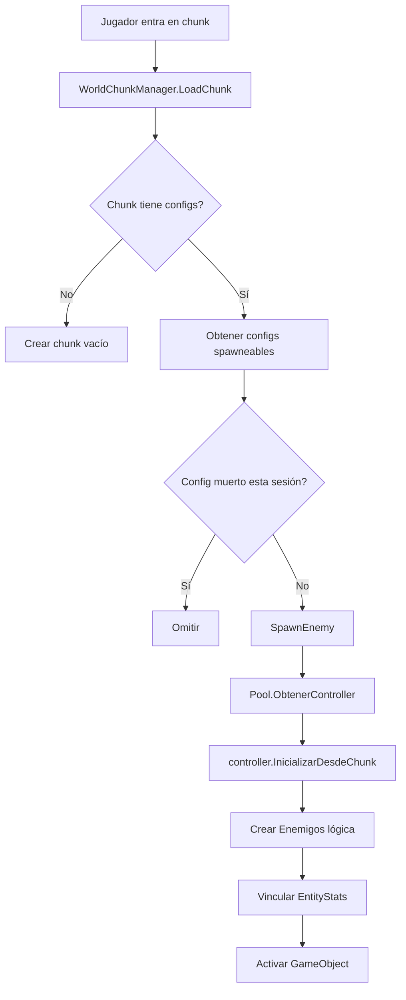
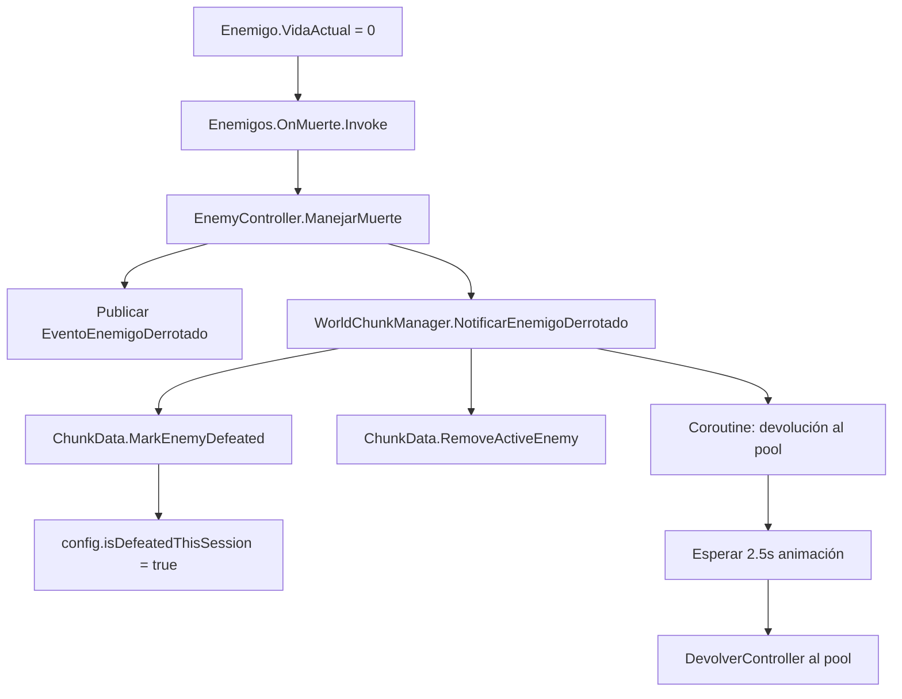

# Sistema de Chunks y Enemigos - Integración Completa

> **📚 Documentación relacionada:**  
> - Pooling genérico: [14_ObjectPool_Refactor.md](14_ObjectPool_Refactor.md)  
> - Sistema de chunks: [24_ChunkSystem.md](24_ChunkSystem.md)  
> - Guía de pooling: [GUIA_SETUP_POOLING.md](GUIA_SETUP_POOLING.md)  
> - Guía de chunks: [GUIA_CHUNK_INTEGRATION.md](GUIA_CHUNK_INTEGRATION.md)

## 📋 Resumen

Sistema completo de gestión de enemigos en el mundo usando chunks para optimización y persistencia de estado por sesión.

**Esta documentación cubre la integración completa de:**
- ✅ EnemigoData (ScriptableObjects)
- ✅ Enemigos (Clases lógicas: Goblin, Orco, Dragon)
- ✅ EnemyController (MonoBehaviour + Pooling)
- ✅ WorldChunkManager (Sistema de chunks)
- ✅ Tracking de muertes por sesión

---

## 🔄 Flujo de Integración

### 1. Definición de Enemigo (ScriptableObject)
```
EnemigoData (SO)
├─> Datos base: vida, ataque, defensa, etc.
├─> Habilidades y pasivas
├─> Método Factory: CrearInstancia() → Enemigos (lógica)
└─> Visual: AnimatorOverrideController
```

### 2. Configuración de Spawn (ChunkSystem)
```
EnemySpawnConfig
├─> enemyData: EnemigoData (SO)
├─> spawnPosition, spawnRotation
├─> Configuración de IA:
│   ├─> initialAIState
│   ├─> patrolWaypoints
│   ├─> detectionRadius
│   └─> chaseRadius
└─> Estado runtime:
    ├─> isDefeated (permanente, para únicos)
    ├─> isDefeatedThisSession (temporal, se resetea)
    └─> activeController (referencia activa)
```

### 3. Chunk (Contenedor de Mundo)
```
ChunkDataAsset (SO - Editor) → ChunkData (Runtime)
├─> coordinates: Vector2Int
├─> enemySpawnConfigs: List<EnemySpawnConfig>
└─> Estado runtime:
    ├─> isLoaded: bool
    ├─> activeEnemies: List<EnemyController>
    └─> Métodos:
        ├─> GetSpawnableConfigs() - solo vivos
        ├─> MarkEnemyDefeated()
        └─> ResetSessionState()
```

---

## 🎮 Flujo de Spawning

### Cuando el jugador entra en un chunk:



### Código simplificado:
```csharp
// WorldChunkManager.SpawnEnemy()
var controller = enemyPoolManager.ObtenerController(config.enemyData);
controller.transform.position = config.spawnPosition;
controller.InicializarDesdeChunk(config.enemyData, config.spawnId, chunkCoords);
config.activeController = controller;
controller.gameObject.SetActive(true);
```

---

## 💀 Flujo de Muerte

### Cuando un enemigo muere:



### Código simplificado:
```csharp
// EnemyController.ManejarMuerte()
EventBus.Publicar(new EventoEnemigoDerrotado { ... });

WorldChunkManager.Instance.NotificarEnemigoDerrotado(
    spawnId, 
    chunkCoords, 
    this
);

// WorldChunkManager.NotificarEnemigoDerrotado()
chunk.MarkEnemyDefeated(spawnId, isPermanent: false);
chunk.RemoveActiveEnemy(controller);
StartCoroutine(DevolverControllerAlPoolConDelay(controller, 2.5f));
```

---

## 🔁 Persistencia por Sesión

### Estado que se mantiene durante la sesión:
- `isDefeatedThisSession`: Enemigos muertos no respawnean
- `activeController`: Referencias a enemigos vivos

### Estado que se preserva entre sesiones:
- `isDefeated`: Solo para enemigos únicos (cuando los implementes)

### Reseteo al reiniciar el juego:
```csharp
// Llamar esto al inicio de una nueva partida
WorldChunkManager.Instance.ResetAllSessionState();

// Esto resetea TODOS los chunks:
foreach (var chunk in chunks.Values)
{
    chunk.ResetSessionState();
    // Cada config: isDefeatedThisSession = false
}
```

---

## 🏗️ Ejemplo de Uso en el Editor

### 1. Crear un ChunkDataAsset
```
Botón derecho en Project → Create → World → Chunk Data
```

### 2. Configurar el chunk:
```
Coordinates: (0, 0)
Enemy Spawns: [3 elementos]

  [0] Spawn Config:
    - spawnId: "goblin_patrol_1"
    - enemyData: GoblinData (SO)
    - spawnPosition: (10, 0, 5)
    - spawnRotation: Identity
    - initialAIState: Patrolling
    - patrolWaypoints: [(10,0,5), (15,0,5), (15,0,10), (10,0,10)]
    - patrolBehavior: Loop
    
  [1] Spawn Config:
    - spawnId: "dragon_boss"
    - enemyData: DragonData (SO)
    - spawnPosition: (50, 0, 50)
    - isUnique: true
    - uniqueId: "dragon_king"
```

### 3. Registrar en el Manager:
```
ChunkDataAsset → Botón derecho → "Registrar en Manager"
```

O desde código:
```csharp
void Start()
{
    WorldChunkManager.Instance.RegisterChunk(miChunkAsset.ToRuntimeData());
}
```

---

## 🎯 Compatibilidad Verificada

### ✅ EnemigoData (SO)
- Define estadísticas y comportamiento base
- Factory method crea la instancia correcta (Goblin, Orco, Dragon)
- Compatible con el sistema de chunks

### ✅ Enemigos (Lógica)
- Subclases específicas: Goblin, Orco, Dragon
- Eventos de muerte, daño, nivel
- Se vinculan a EnemyController correctamente

### ✅ EnemyController (Unity Component)
- Implementa IPooleable para object pooling
- Se inicializa correctamente desde el chunk
- Notifica al chunk cuando muere
- No se auto-devuelve al pool (evita double-return)

### ✅ WorldChunkManager
- Carga/descarga chunks según posición del jugador
- Spawnea enemigos correctamente
- Trackea muertes por sesión
- Maneja el pool de forma centralizada

### ✅ ObjectPooling
- DynamicEnemyPoolManager crea pools on-demand
- Controllers se reutilizan correctamente
- Callbacks de IPooleable funcionan

---

## 🚨 Problemas Resueltos

### ❌ ANTES: Controller sin inicializar
```csharp
// WorldChunkManager spawneaba sin inicializar
var controller = pool.ObtenerController(config.enemyData);
// ❌ No llamaba Inicializar()
```

### ✅ AHORA: Controller correctamente inicializado
```csharp
var controller = pool.ObtenerController(config.enemyData);
controller.InicializarDesdeChunk(config.enemyData, config.spawnId, chunkCoords);
// ✅ Crea Enemigos lógica y vincula EntityStats
```

---

### ❌ ANTES: Doble devolución al pool
```csharp
// EnemyController auto-devolvía al pool
// WorldChunkManager también devolvía al descargar chunk
// = DOBLE DEVOLUCIÓN
```

### ✅ AHORA: Devolución centralizada
```csharp
// EnemyController solo notifica y desactiva
WorldChunkManager.Instance.NotificarEnemigoDerrotado(...);

// WorldChunkManager devuelve al pool SOLO cuando corresponde
```

---

### ❌ ANTES: Enemigos respawneaban al recargar
```csharp
// No había tracking de muerte
// Siempre spawneaba todos los configs
```

### ✅ AHORA: Tracking por sesión
```csharp
// ChunkData.GetSpawnableConfigs() excluye muertos
if (config.isDefeatedThisSession)
    return false; // No spawnear
```

---

## 📊 Estadísticas

```csharp
// WorldChunkManager proporciona:
int TotalChunks { get; }
int LoadedChunksCount { get; }
int TotalActiveEnemies { get; }

// ChunkData proporciona:
ChunkStats GetStats()
{
    ChunkId,
    Coordinates,
    IsLoaded,
    TotalSpawns,
    ActiveEnemies,
    UniqueEnemies,
    DefeatedUniques
}
```

---

## 🔮 Próximos Pasos (TODO)

### 1. Sistema de IA
- Implementar `ApplyAIConfiguration()` en WorldChunkManager
- Crear componente `EnemyAI` en EnemyController
- Patrullaje, detección, persecución

### 2. Enemigos Únicos
- Guardar `isDefeated` permanentemente
- Sistema de guardado (SaveManager)
- Bosses que no respawnean nunca

### 3. Animaciones
- Integrar con `AnimatorOverrideController`
- Estados: Idle, Patrol, Alert, Chase, Attack, Death
- Transiciones basadas en AIState

### 4. Configuración Visual en Editor
- Custom Inspector para EnemySpawnConfig
- Visualización de waypoints en Scene View
- Botón "Test Spawn" para debugging

---

## 🐛 Debugging

### Ver estado del sistema:
```csharp
// En WorldChunkManager:
[ContextMenu("Debug: Mostrar Estado")]
```

### Logs útiles:
```
✨ WorldChunkManager inicializado
📦 Creando pool: GoblinData
📦 Cargando chunk (0, 0)
👹 Enemigo inicializado: Goblin [Nv.1]
💀 Enemigo derrotado: goblin_patrol_1 en chunk (0, 0)
♻️ Controller devuelto al pool
```

### Inspeccionar chunks en runtime:
```csharp
var chunk = WorldChunkManager.Instance.GetChunk(new Vector2Int(0, 0));
Debug.Log($"Activos: {chunk.activeEnemies.Count}");
Debug.Log($"Spawns totales: {chunk.enemySpawnConfigs.Count}");
Debug.Log($"Spawneables: {chunk.GetSpawnableConfigs().Count}");
```

---

## ✅ Conclusión

El sistema está **completamente integrado** y funcional:
- EnemigoData → Enemigos → EnemyController fluye correctamente
- Chunks gestionan spawning y persistencia
- Object pooling optimiza memoria
- Enemigos muertos no respawnean hasta reiniciar
- Fácil de extender con IA y animaciones

**No hay incompatibilidades** entre los sistemas. Todo funciona en armonía. 🎉
