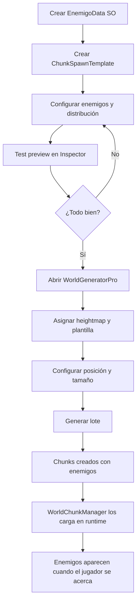

# 🎯 Guía Rápida: Sistema de Plantillas de Spawn

## 📋 ¿Qué es esto?

Sistema para **generar automáticamente enemigos** cuando creas chunks con el **WorldGeneratorPro**. En lugar de configurar manualmente cada enemigo en cada chunk, creas una **plantilla reutilizable** y la aplicas a todos los chunks que generes.

---

## 🚀 Inicio Rápido (3 pasos)

### 1️⃣ Crear una Plantilla de Spawns

```
Project Panel → Click derecho → Create → World → Chunk Spawn Template
```

Se creará un asset llamado `SpawnTemplate.asset`

### 2️⃣ Configurar la Plantilla

Selecciona el asset creado y configura en el Inspector:

**Información básica:**
- `Template Name`: "Bosque con Goblins" (o el nombre que quieras)
- `Description`: Descripción opcional de qué representa

**Spawn Definitions** (los enemigos que aparecerán):
- Click en `+` para agregar un tipo de enemigo
- `Enemy Data`: Arrastra aquí el EnemigoData (SO) del Goblin, Orco, etc.
- `Count`: Cuántos de este enemigo por chunk (ej: 5)

**Distribución:**
- `Distribution Type`: 
  - **Grid** - Grid uniforme (recomendado para muchos enemigos)
  - **Random** - Posiciones aleatorias con espaciado
  - **Perimeter** - Alrededor de los bordes
  - **Center** - Círculo central (bueno para bosses)

**Parámetros:**
- `Edge Margin`: Espacio desde los bordes (10m recomendado)
- `Min Spacing`: Distancia mínima entre enemigos (15m recomendado)

**IA:**
- `Default AI State`: **Patrolling** (recomendado)
- `Auto Generate Waypoints`: ✅ Activado (genera rutas automáticas)
- `Waypoints Per Enemy`: 4 (número de puntos en la ruta)
- `Waypoint Radius`: 10m (tamaño de la ruta)

### 3️⃣ Usar la Plantilla en el Generador

```
Unity → Tools → Generador de Mundo PRO
```

En la ventana:
1. Configura posición, tamaño, heightmap (como antes)
2. En la sección **"👹 Enemigos y Spawns"**:
   - Arrastra tu plantilla al campo `Plantilla de Spawns`
3. Haz click en **"🚀 GENERAR LOTE"**

✅ ¡Listo! Los chunks se crearán con los enemigos configurados automáticamente.

---

## 📝 Ejemplos de Configuración

### Ejemplo 1: Zona de Goblins (Patrullando)

```
Template Name: "Zona Goblins"
Distribution Type: Random

Spawn Definitions:
├─ [0] Goblin Normal
│   ├─ Enemy Data: GoblinData
│   ├─ Count: 8
│   └─ Override AI State: No
│
└─ [1] Goblin Elite  
    ├─ Enemy Data: GoblinEliteData
    ├─ Count: 2
    └─ Is Unique: No

Settings:
├─ Default AI State: Patrolling
├─ Auto Generate Waypoints: ✅
├─ Waypoints Per Enemy: 4
└─ Waypoint Radius: 12m
```

### Ejemplo 2: Boss Room (Centro)

```
Template Name: "Boss Room"
Distribution Type: Center

Spawn Definitions:
├─ [0] Dragon Boss
│   ├─ Enemy Data: DragonBossData
│   ├─ Count: 1
│   ├─ Override AI State: ✅
│   ├─ AI State: Idle
│   └─ Is Unique: ✅
│
└─ [1] Goblin Minions
    ├─ Enemy Data: GoblinData
    ├─ Count: 6
    └─ Is Unique: No

Settings:
├─ Default AI State: Patrolling
├─ Auto Generate Waypoints: ✅
└─ Waypoints Per Enemy: 3
```

### Ejemplo 3: Guardias en Perímetro

```
Template Name: "Guardias Perimetro"
Distribution Type: Perimeter

Spawn Definitions:
└─ [0] Orco Guardian
    ├─ Enemy Data: OrcoData
    ├─ Count: 12
    ├─ Override AI State: ✅
    └─ AI State: Idle

Settings:
├─ Default AI State: Idle
├─ Auto Generate Waypoints: ❌
└─ Edge Margin: 5m
```

---

## 🔍 Debugging y Verificación

### Ver Preview de la Plantilla

1. Selecciona la plantilla en el Project Panel
2. En el Inspector, click en **"🔍 Preview Distribución"**
3. Revisa la consola para ver las posiciones generadas

### Test Rápido

1. En el Inspector de la plantilla
2. Click en **"🧪 Test en Chunk (0,0)"**
3. Verifica que no haya errores

### Ver Enemigos en Scene

Después de generar chunks:
1. En Hierarchy, expande `--- WORLD ENVIRONMENT ---`
2. Selecciona un `Chunk_X_Y`
3. En Project, busca `Assets/Resources/World/Chunks/Chunk_X_Y_Data.asset`
4. En el Inspector verás la lista `Enemy Spawns` con todos los enemigos

---

## 💡 Tips y Buenas Prácticas

### ✅ Recomendaciones

1. **Usa Distribution Type: Random** para zonas naturales (bosques, montañas)
2. **Usa Distribution Type: Grid** para dungeons o zonas organizadas
3. **Activa Auto Generate Waypoints** para patrullas automáticas
4. **Edge Margin mínimo 10m** para evitar enemigos en los bordes exactos
5. **Min Spacing de 15m** para evitar superposiciones

### ⚠️ Evitar

1. ❌ No pongas demasiados enemigos (más de 20) por chunk (problemas de rendimiento)
2. ❌ No uses Min Spacing muy pequeño (< 5m)
3. ❌ No olvides asignar el EnemigoData en cada definición
4. ❌ No uses Distribution Center con muchos enemigos (se amontonan)

### 🎨 Organización

Crea carpetas por tipo de zona:

```
Assets/
└─ SpawnTemplates/
   ├─ Bosques/
   │  ├─ BosqueGoblins.asset
   │  └─ BosqueOrcos.asset
   ├─ Montañas/
   │  ├─ MontañaDragones.asset
   │  └─ MontañaCuevas.asset
   └─ Bosses/
      ├─ DragonBossRoom.asset
      └─ GoblinKingRoom.asset
```

---

## 🔧 Configuración Avanzada

### Waypoints Personalizados

Si quieres rutas específicas en lugar de automáticas:

1. En Spawn Definition, desactiva `Override AI State: ✅`
2. En `Custom Waypoints`, agrega posiciones **relativas** al spawn
   - Ejemplo: `(5, 0, 0)` = 5 metros a la derecha del spawn
   - Ejemplo: `(0, 0, 10)` = 10 metros adelante

### Tags Personalizados

Agrega tags para lógica especial:

```
Custom Tags:
├─ "agresivo"
├─ "nocturno"
└─ "boss_minion"
```

Luego en código puedes verificar:
```csharp
if (config.HasTag("agresivo"))
{
    // Lógica especial
}
```

---

## 🐛 Solución de Problemas

### "No aparecen enemigos en el chunk"

✅ Verifica:
1. ¿Asignaste la plantilla en el WorldGeneratorPro?
2. ¿La plantilla tiene Spawn Definitions con Enemy Data asignado?
3. ¿El Count es mayor a 0?
4. ¿Hay un WorldChunkManager en la escena?
5. ¿El DynamicEnemyPoolManager está configurado?

### "Los enemigos se superponen"

✅ Solución:
1. Aumenta `Min Spacing` en la plantilla
2. Usa `Distribution Type: Random` en lugar de Grid
3. Reduce el `Count` de enemigos

### "Los enemigos no patrullan"

✅ Verifica:
1. `Default AI State: Patrolling`
2. `Auto Generate Waypoints: ✅`
3. `Waypoints Per Enemy: >= 2`

---

## 📚 Documentación Relacionada

- [24_ChunkSystem.md](24_ChunkSystem.md) - Sistema de chunks completo
- [25_Sistema_Chunks_Enemigos.md](25_Sistema_Chunks_Enemigos.md) - Integración con enemigos
- [GUIA_CHUNK_INTEGRATION.md](GUIA_CHUNK_INTEGRATION.md) - Integración paso a paso

---

## 🎯 Flujo de Trabajo Completo



---

## ✨ Resumen

**Antes:**
- Crear chunk manualmente
- Agregar cada enemigo uno por uno
- Configurar posiciones, waypoints, IA...
- Repetir para cada chunk 😫

**Ahora:**
- Crear plantilla una vez ✅
- Aplicarla a todos los chunks que quieras ✅
- Todo configurado automáticamente ✅
- Reutilizable y flexible ✅

**¡Disfruta generando tu mundo!** 🎮
