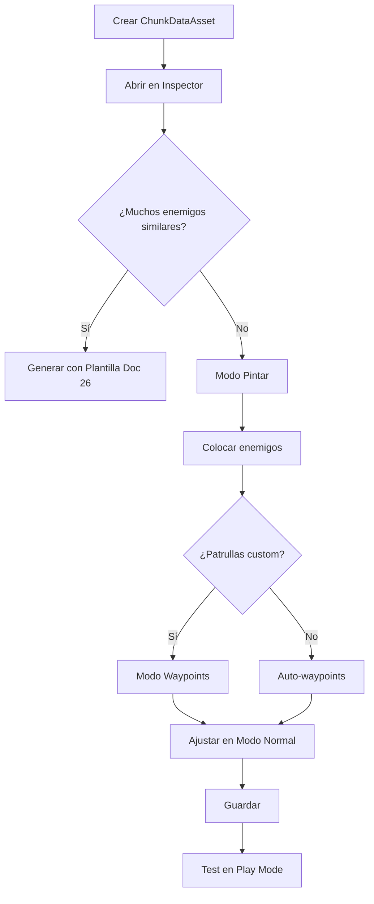

# 🎨 Editor Visual de Chunks - Guía Completa

## 📋 ¿Qué es esto?

**Editor visual interactivo** para colocar enemigos dentro de chunks y configurar sus rutas de patrulla directamente en la **Scene View** de Unity.

**Ya no necesitas:**
- ❌ Escribir coordenadas manualmente
- ❌ Adivinar posiciones
- ❌ Configurar waypoints a ciegas

**Ahora puedes:**
- ✅ Pintar enemigos con clicks
- ✅ Ver todo visualmente en 3D
- ✅ Arrastrar y mover enemigos/waypoints
- ✅ Configurar comportamiento en tiempo real

---

## 🚀 Inicio Rápido (3 pasos)

### 1️⃣ Abrir el Editor

```
Project → Selecciona un ChunkDataAsset
Inspector → Se abrirá automáticamente el editor
```

### 2️⃣ Activar Modo Pintar

```
En el Inspector:
├─ Click en "🎨 Modo Pintar"
├─ Arrastra un EnemigoData al campo "Enemigo a Pintar"
└─ Selecciona "Estado IA: Patrolling"
```

### 3️⃣ Pintar Enemigos

```
En Scene View:
├─ Click dentro del chunk (área con grid)
├─ Se coloca el enemigo
└─ Automáticamente genera waypoints circulares
```

✅ ¡Listo! Enemigo colocado con patrulla automática

---

## 🎮 Modos de Trabajo

### 🎨 Modo Pintar
**Para:** Colocar enemigos en el chunk

**Cómo usar:**
1. Activa "🎨 Modo Pintar"
2. Asigna el EnemigoData que quieres colocar
3. Configura:
   - **Estado IA**: Patrolling, Idle, Resting, etc.
   - **Auto-generar Waypoints**: ✅ (recomendado para Patrolling)
4. Click en Scene View para colocar

**Tips:**
- Cada click coloca un nuevo enemigo
- La rotación es aleatoria (puedes ajustarla después)
- Si Auto-waypoints está activo, crea 4 puntos circulares

---

### 🗺️ Modo Waypoints
**Para:** Definir rutas de patrulla personalizadas

**Cómo usar:**
1. Selecciona un enemigo de la lista
2. Activa "🗺️ Modo Waypoints"
3. Click en Scene View para agregar puntos
4. Configura el Comportamiento:
   - **Loop**: 1→2→3→1 (continuo)
   - **PingPong**: 1→2→3→2→1 (ida y vuelta)
   - **Random**: Aleatorio
   - **Once**: Una vez y para

**Tips:**
- Los waypoints se muestran con esferas amarillas
- Líneas conectan los puntos
- Puedes arrastrar waypoints con los handles

**Atajos:**
- **Limpiar Waypoints**: Borra todos los puntos
- **Arrastrar waypoint**: Mueve el punto visualmente

---

### 🗑️ Modo Borrar
**Para:** Eliminar enemigos del chunk

**Cómo usar:**
1. Activa "🗑️ Modo Borrar"
2. Click sobre un enemigo (esfera roja) para eliminarlo

**Tips:**
- Los enemigos se muestran en rojo
- Click directo sobre la esfera (radio de 2 metros)
- Confirma la eliminación en la consola

---

### 👁️ Modo Normal (Edición)
**Para:** Seleccionar, mover y rotar enemigos

**Cómo usar:**
1. Desactiva todos los modos especiales
2. Click sobre un enemigo para seleccionarlo
3. Usa los handles:
   - **Flechas**: Mover posición
   - **Círculos**: Rotar orientación

**Tips:**
- El enemigo seleccionado aparece en verde
- Sus waypoints se muestran en amarillo
- Ajusta transform con precisión

---

## 🔧 Herramientas Rápidas

### Auto-Grid
Coloca todos los enemigos en un grid uniforme

```
Uso: Cuando tengas muchos enemigos y quieras distribuirlos uniformemente
Resultado: Grid NxN centrado en el chunk
```

### Círculo
Coloca enemigos en círculo alrededor del centro

```
Uso: Para patrullas circulares o guardias perimetrales
Resultado: Círculo con enemigos mirando al centro
```

### Línea
Coloca enemigos en línea horizontal

```
Uso: Para patrullas en fila o guardias en muro
Resultado: Línea de oeste a este
```

### Generar Waypoints
Genera waypoints circulares para todos los enemigos con estado Patrolling/Idle

```
Uso: Aplicar patrullas rápidas a todos
Resultado: 4 waypoints circulares por enemigo
```

### Limpiar Todo
Elimina TODOS los enemigos del chunk

```
Uso: Empezar de cero
⚠️ Pide confirmación
```

---

## 📋 Ejemplos Prácticos

### Ejemplo 1: Zona de Patrulla Básica

```
1. Modo Pintar → GoblinData
2. Estado IA: Patrolling
3. Auto-waypoints: ✅
4. Click 5 veces en el chunk
5. ✅ 5 Goblins patrullando en círculos
```

### Ejemplo 2: Boss Room con Guardianes

```
1. Modo Pintar → DragonBossData
   Estado IA: Idle
   Auto-waypoints: ❌
   Click en el centro
   
2. Cambiar a → GoblinData
   Estado IA: Patrolling
   Click 6 veces alrededor
   
3. Herramienta: Círculo
   
4. ✅ Boss central con 6 guardias en círculo
```

### Ejemplo 3: Patrulla Personalizada

```
1. Modo Pintar → OrcoData
   Estado IA: Patrolling
   Auto-waypoints: ❌
   Click en posición inicial
   
2. Seleccionar el enemigo en la lista
3. Modo Waypoints
4. Click en 4+ posiciones para crear ruta
5. Comportamiento: Loop
   
6. ✅ Orco con ruta personalizada
```

### Ejemplo 4: Guardias Estáticos en Línea

```
1. Modo Pintar → OrcoGuardiaData
   Estado IA: Idle
   Auto-waypoints: ❌
   Click 8 veces
   
2. Herramienta: Línea
   
3. Ajustar rotaciones manualmente
   
4. ✅ 8 Guardias en fila mirando al frente
```

---

## 📊 Interfaz del Inspector

### Sección Paint Mode
```
🎨 Modo Pintar
├─ Botón: Activar/Desactivar
├─ Enemigo a Pintar: [EnemigoData]
├─ Estado IA: [Dropdown]
└─ Auto-generar Waypoints: [Checkbox]
```

### Sección Waypoint Mode
```
🗺️ Modo Waypoints
├─ Botón: Activar/Desactivar
├─ Waypoints del spawn X: [Número]
├─ Comportamiento: [Dropdown]
└─ Botón: Limpiar Waypoints
```

### Sección Delete Mode
```
🗑️ Modo Borrar
└─ Botón: Activar/Desactivar
```

### Sección Herramientas
```
🔧 Herramientas Rápidas
├─ [Auto-Grid] [Círculo] [Línea]
└─ [Generar Waypoints] [Limpiar Todo]
```

### Sección Lista
```
📋 Lista de Enemigos (5)
├─ [#0] Goblin | Patrolling | WP: 4 [X]
├─ [#1] Goblin | Patrolling | WP: 4 [X]
├─ [#2] Orco | Idle | WP: 0 [X]
...

Al seleccionar uno:
  ├─ Enemy Data: [SO]
  ├─ Estado IA: [Enum]
  ├─ Comportamiento: [Enum]
  ├─ Es Único (Boss): [Checkbox]
  └─ [Focalizar en Scene View]
```

### Sección Visualización
```
👁️ Visualización
├─ Mostrar Labels: [✓]
├─ Mostrar Waypoints: [✓]
└─ Tamaño Iconos: [Slider: 1.0]
```

---

## 🎨 Visualización en Scene View

### Elementos Visuales

**Chunk:**
- Cuadrado con wireframe del color asignado
- Grid interno (10x10) para referencia
- Tamaño: 256x256 metros (sincronizado con WorldChunkManager)

**Enemigos:**
- **Esfera**: Posición del enemigo
  - Cyan: Normal
  - Verde: Seleccionado
  - Rojo: Modo borrar
- **Cono azul**: Dirección hacia donde mira
- **Label blanco**: Nombre y estado IA

**Waypoints:**
- **Esferas amarillas**: Puntos de patrulla
- **Líneas amarillas**: Conexiones entre puntos
- **Línea punteada**: Desde spawn al primer waypoint
- **Línea punteada**: Cierre del loop (si aplica)
- **Labels**: WP0, WP1, WP2...

**HUD en Pantalla:**
```
┌─────────────────────────┐
│ 📦 Chunk_0_0           │
│ 🎨 MODO PINTAR         │
│ Pintando: Goblin       │
│ Enemigos: 5            │
└─────────────────────────┘
```

---

## 💡 Tips y Buenas Prácticas

### ✅ Recomendaciones

1. **Usa Auto-waypoints** para patrullas rápidas
2. **Nombra los chunks** descriptivamente (Chunk_Bosque_Norte)
3. **Agrupa enemigos similares** en la misma área
4. **Espaciado de 10-15m** entre enemigos para evitar superposición
5. **Modo Normal** para ajustes finos de posición/rotación
6. **Guarda frecuentemente** (Ctrl+S)

### ⚠️ Evitar

1. ❌ No coloques muchos enemigos (>20) en un solo chunk
2. ❌ No uses waypoints muy juntos (<5m)
3. ❌ No olvides asignar el EnemigoData antes de pintar
4. ❌ No uses Loop con solo 1 waypoint
5. ❌ No coloques enemigos fuera del chunk (no se verán)

### 🎯 Flujo de Trabajo Eficiente



---

## 🔗 Integración con Otros Sistemas

### Con Doc 26 (Plantillas)
```
Plantilla genera → ChunkDataAsset poblado
                   ↓
           Editor Visual refina
                   ↓
           Ajustes manuales precisos
```

### Con WorldChunkManager
```
ChunkDataAsset → RegisterChunk()
                   ↓
           Runtime carga enemigos
                   ↓
           Pooling + Spawning
```

---

## 🐛 Solución de Problemas

### "No puedo colocar enemigos"
✅ Verifica:
1. ¿Modo Pintar está activo?
2. ¿Asignaste un EnemigoData?
3. ¿Estás haciendo click DENTRO del chunk (grid)?
4. ¿El chunk está en coordenadas correctas?

### "Los waypoints no aparecen"
✅ Verifica:
1. ¿Modo Waypoints está activo?
2. ¿Seleccionaste un enemigo de la lista?
3. ¿"Mostrar Waypoints" está activo?
4. ¿El enemigo tiene estado Patrolling?

### "No veo el grid del chunk"
✅ Verifica:
1. ¿El ChunkDataAsset está seleccionado?
2. ¿Scene View está en modo 3D (no 2D)?
3. ¿Las coordenadas del chunk son correctas?

### "Los enemigos no aparecen en Play Mode"
✅ Verifica:
1. ¿Guardaste el ChunkDataAsset? (Ctrl+S)
2. ¿Hay un WorldChunkManager en la escena?
3. ¿El chunk está registrado en el manager?
4. ¿El jugador está cerca del chunk?

---

## 🎓 Atajos de Teclado

| Atajo | Acción |
|-------|--------|
| Click | Colocar enemigo (Paint) / Agregar waypoint (Waypoint) / Eliminar (Delete) |
| Click + Drag | Mover enemigo/waypoint (Modo Normal) |
| W | Tool de movimiento (Unity) |
| E | Tool de rotación (Unity) |
| F | Focalizar selección |
| Ctrl+Z | Deshacer |
| Ctrl+S | Guardar |

---

## 📚 Documentación Relacionada

- [24_ChunkSystem.md](24_ChunkSystem.md) - Sistema de chunks
- [25_Sistema_Chunks_Enemigos.md](25_Sistema_Chunks_Enemigos.md) - Integración enemigos
- [26_Sistema_Plantillas_Spawn.md](26_Sistema_Plantillas_Spawn.md) - Generación automática
- [GUIA_CHUNK_INTEGRATION.md](GUIA_CHUNK_INTEGRATION.md) - Setup inicial

---

## ✨ Resumen Visual

```
ANTES (Manual):
  ChunkDataAsset.enemySpawns[0]:
    spawnPosition: (10.5, 0, 23.7) ← ¿Dónde está eso?
    patrolWaypoints: [(15,0,20), (20,0,25)] ← ¿Cómo se ve?

AHORA (Visual):
  👁️ Ves el chunk en 3D
  🎨 Click para colocar
  🗺️ Click para waypoints
  ✅ Todo visual e inmediato
```

**¡Disfruta editando tus chunks visualmente!** 🎮
